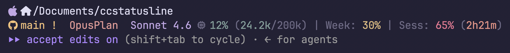

# ClaudeCode Statusline

An adaptive, theme-aware statusline for [Claude Code](https://claude.ai/code). Colors are pulled live from your terminal emulator or wallpaper tool — no hardcoded palette.

---

## Preview



| Line | Content |
|---|---|
| 1 | Distro icon · path (home shown as  icon) |
| 2 | Git status · plan · model · context % (tokens/max) · week % · session % + countdown |
| 3 | Claude Code mode indicator (automatic) |

---

## Install

```bash
bash install-statusline.sh
```

The installer detects your OS and terminal, optionally sets up JetBrainsMono Nerd Font, writes `~/.claude/statusline-command.sh`, and registers it in `~/.claude/settings.json`. **On Omarchy**, it also offers to patch the real Omarchy logo directly into JetBrainsMono Nerd Font (see [`nerdfont-patch/`](nerdfont-patch)) so the distro icon renders as the actual logo instead of a generic Linux/Arch glyph.

```bash
bash install-statusline.sh -y   # non-interactive
```

Open a new Claude Code session — the statusline appears immediately.

---

## Requirements

| | |
|---|---|
| [Claude Code](https://claude.ai/code) | CLI |
| [Nerd Font](https://www.nerdfonts.com/) | JetBrainsMono NF offered automatically by installer |
| `jq` | JSON parsing |
| bash 5+ | macOS ships bash 3 — `brew install bash` if needed |

---

## Color sources

Colors are probed in order; first match wins.

**macOS**
| Terminal | Source |
|---|---|
| Ghostty | `~/.config/ghostty/config` — theme file + inline overrides |
| Alacritty | `~/.config/alacritty/alacritty.toml` |
| iTerm2 | `~/Library/Preferences/com.googlecode.iterm2.plist` |
| Terminal.app | ANSI fallback (color data not accessible from bash) |

**Linux**
| Tool | Source |
|---|---|
| Noctalia / Matugen | `colors.json` — Material You palette |
| Wallust / pywal | `colors.json` — 16-color pywal palette |
| Omarchy | `current/theme/alacritty.toml` |

Falls back to standard ANSI colors on any unrecognised setup.

---

## Statusline segments

| Segment | Color | Notes |
|---|---|---|
| Distro / OS icon |  Iris | Written to `~/.claude/.distro-icon` at install time — the real logo on Omarchy if the font was patched, otherwise a generic distro glyph |
|  Path |  Text | `$HOME` replaced with  icon |
|  Branch |  Gold | GitHub icon + branch name |
| ` ✓` clean |  Green | Working tree has no changes |
| ` +` staged |  Rose | |
| ` !` modified |  Gold | |
| ` ?` untracked |  Muted | |
| Plan badge |  Rose | Read from `~/.claude/settings.json` |
| Model name |  Iris | |
| `󰍛 N% (Xk/Yk)` |  Gradient | Context window used with raw token count — appears after first message exchange |
| `Week: N%` |  Gradient | 7-day rolling rate limit |
| `Sess: N% (Xh Ym)` |  Gradient | 5-hour session usage + time until reset |

Usage percentages use a smooth green → gold → red gradient as limits approach.

---

## Development

The working copy is `statusline-command.sh`. `install-statusline.sh` embeds it verbatim in a `<<'STATUSEOF'` heredoc — both must always match.

**Test render:**
```bash
printf '%s' '{"workspace":{"current_dir":"'"$PWD"'"},"model":{"display_name":"Sonnet 4.6"},"context_window":{"used_percentage":10},"rate_limits":{"seven_day":{"used_percentage":20},"five_hour":{"used_percentage":5,"resets_at":'"$(( $(date +%s) + 14400 ))"'}}}' \
  | bash statusline-command.sh
```

**Re-sync heredoc after editing:**
```bash
INSTALLER=install-statusline.sh
STATUSLINE=statusline-command.sh
OPEN=$(grep -n "<<'STATUSEOF'" "$INSTALLER" | cut -d: -f1)
CLOSE=$(grep -n "^STATUSEOF$"   "$INSTALLER" | cut -d: -f1)
head -"$OPEN" "$INSTALLER" > /tmp/i.sh
cat "$STATUSLINE" >> /tmp/i.sh
tail -n +"$CLOSE" "$INSTALLER" >> /tmp/i.sh
mv /tmp/i.sh "$INSTALLER" && chmod +x "$INSTALLER"
diff <(sed -n "$((OPEN+1)),$((CLOSE-1))p" "$INSTALLER") "$STATUSLINE"  # expect empty
```

See [`CLAUDE.md`](CLAUDE.md) for the full developer guide: palette mapping, gotchas, and performance notes.

---

## Changelog

### v1.3
- Added `nerdfont-patch/` — splices the real Omarchy logo into JetBrainsMono Nerd Font at U+FFF00, validated (`fc-validate` + FreeType rasterization + byte-identical comparison of every untouched glyph) before it ever touches the live font. Installer offers it as a step on Omarchy, replacing the previous placeholder codepoint (U+E900, unrenderable without the font itself loaded) that the distro-icon mapping shipped with but never actually delivered

### v1.2
- Context segment now shows raw token count alongside the percentage: `󰍛 12% (24.2k/200k)`. The used-token count shares the same gradient color as the percentage; the denominator stays muted. Falls back to percent-only before the first API response or after `/compact`.

### v1.1
- Fixed timestamp rendering bug (`Sess: 1780267200%`) caused by `IFS=$'\t'` collapsing empty TSV fields — switched to `\x1f` Unit Separator delimiter
- Added hex validation and sync helper for backup operations
- Bash 3.2 compatibility fix for backup clobbering

### v1.0
- Initial release: adaptive two-line statusline with distro icon, git status, plan badge, model name, context %, week %, and session % with countdown
- macOS: Ghostty, Alacritty, iTerm2 palette detection
- Linux: Noctalia, Matugen, Wallust, pywal, Omarchy palette detection
- Smooth RGB gradient across all usage meters

---

## License

MIT
